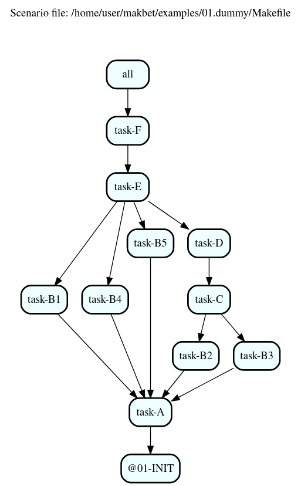

Welcome to **makbet** project!

|

**makbet** stands for **mak**\ (efile) **b**\ (ased) **e**\ (xtraordinary)
**t**\ (ool).

Keep reading && have fun! :)

|

----

**Table of Contents**
---------------------

- | `About`_
- | `Key features`_
- | `System requirements`_
- | `Installing`_
- | `Few words regarding backward compatibility`_
- | `DOT output`_
- | `PNG output`_
- | `CSV output`_
- | `Profiling`_
- | `Saving profiling results in CSV files`_
- | `References`_
- | `Contributing`_
- | `License`_
- | `Mission statement`_

|

About
-----

This project has been created for several reasons...

Mainly to help:

- automating various complex scenarios,
- modeling, and prototyping complex real-life processes consisting of many
  tasks having many dependencies (e.g.: production or delivery chains),
- reflecting, simulating and profiling complicated existing flows,
- visualizing dependencies in big projects (**makbet** can help to find
  circular dependencies, or long execution paths),
- optimizing execution paths in existing systems.

But also to help:

- learning **GNU Make** utility,
- learning **DOT** language,
- learning **Bash** scripting.

|

And (the last but not least):

- **FOR FUN! :)**

|

Key features
------------

The **makbet's** key features are:

- based on **GNU Make** tool and its features,
- easily extensible,
- built-in excellent support for parallelism (using jobserver mechanism
  from **GNU Make**),
- can be easily added/embedded into existing projects as a 3rd party SW,
- no ``root/admin`` privileges required,
- pure console tool - no GUI required for usage,
- good and fast integration with other console tools,
- fast and easy installation process,
- unified naming scheme of all environment variables (every **makbet's**
  environment variable has ``MAKBET_`` prefix),
- unified syntax of all CLI options (every **makbet's** CLI option has
  ``MAKBET_`` prefix),
- saving tasks' details in **key=value** ``*.cfg`` files for further
  usage (e.g.: by shell scripts),
- saving tasks' details in ``*.csv`` files for further processing if needed
  (this feature can be enabled by ``MAKBET_CSV=1`` CLI option),
- time profiling - measuring tasks duration (this feature can be enabled by
  ``MAKBET_PROF=1`` CLI option),
- generating **DOT** output showing relations between tasks (this feature
  can be enabled by ``MAKBET_DOT=1`` CLI option),
- written in self-explanatory code,
- widely and richly commented,
- contains few useful examples, including small built-in tasks library (set
  of several, simple **Bash** scripts),
- based on easy development model (all features are being developed on a
  ``master`` branch, while all releases are made from dedicated
  ``stable/vMAJOR.minor.x`` branches),
- it's developed according to good SW development practices,
- it's easy to debug (all debugging ways and techniques for makefiles
  and shell scripts can be used),
- tested `continuously <https://github.com/skaluzka/makbet/actions>`_ (for
  every commit and pull request) on ``master`` branch and all stable
  branches,
- follows so-called **semver** (`<https://semver.org>`_) versioning patterns
  (see also `Few words regarding backward compatibility`_ section),
- minimal system requirements (see details in `System requirements`_ section).

|

System requirements
-------------------

Well... Nothing special here :)

The only system requirements are:

- **GNU/Linux** compatible OS.
- **GNU Make** tool (version **3.82** or newer).
- **Bash** interpreter (available in ``/bin/bash`` location).

All provided examples were tested with **GNU Make 4.3** and **Bash 5.0.16**.

|

Installing
----------

Installing **makbet** is easy and straightforward.

- Clone (or alternatively download + unpack) **makbet** project from GitHub.
- Export ``MAKBET_PATH`` variable pointing to **makbet's** main directory
  (e.g.: ``export MAKBET_PATH=/home/user/makbet``).
- Change directory to main **makbet's** directory then run ``make`` command
  (without options) to see default help message.

|

That's all! :)

|

Since now you are ready to write your own **makbet's** scenarios (you can
base on provided scenario `template <templates/scenario>`_) or play with
built-in `examples <examples>`_.

|

Few words regarding backward compatibility
------------------------------------------

Please be aware that **makbet** is still in heavy development phase (no
**major** release has been published so far).

A couple of nice improvements have been proposed already (see the details
`here <https://github.com/skaluzka/makbet/issues>`_) and there is no guarantee
that backward compatibility will be kept forever (at least until the first
**major** version will be released).

Therefore **please always use stable versions on the production**.

In doubts, follow the common sense and use `semantic versioning
<https://semver.org>`_ approach.

|

DOT output
----------

For every properly created scenario **makbet** is able to generate output
in **DOT** - popular graph language (in a form of so-called
**digraph** - directed graph - showing the flow direction between all tasks).
Such output can be easily saved or redirected to file.  This can be achieved
by passing ``MAKBET_DOT=1`` option to ``make`` execution command (by default
``MAKBET_DOT=0``) as in below example:

::

  [user@localhost 01.dummy]$ make makbet-clean && make all MAKBET_DOT=1

  2020-08-10 00:54:58.826 [INFO]: Task "@01-INIT" (TASK_ID: 1) started.

  2020-08-10 00:54:58.844 [INFO]: Task "@01-INIT" (TASK_ID: 1) terminated.

  2020-08-10 00:54:58.918 [INFO]: Task "task-A" (TASK_ID: 2) started.

  ...

  2020-08-10 00:55:09.030 [INFO]: Task "all" (TASK_ID: 13) started.

  2020-08-10 00:55:09.047 [INFO]: Task "all" (TASK_ID: 13) terminated.

  [user@localhost 01.dummy]$

Special **makbet's** target ``.show-merged-dot-results`` will display
the **DOT** results which can be used for further processing:

::

  [user@localhost 01.dummy]$ make .show-merged-dot-results

  digraph {

  // This file has been generated by makbet master+g89af641-2020-10-18T22:35:22+02:00
  // Generation date: Sun Oct 18 11:37:21 PM CEST 2020
  // Scenario file: /home/user/makbet/examples/01.dummy/Makefile

  // Define graph title.
  labelloc="t";
  label="Scenario file: /home/user/makbet/examples/01.dummy/Makefile\n\n\n\n";

  // Define global options for all nodes.
  node [shape="box" style="rounded, bold, filled" fillcolor="azure"];

  // TASK_NAME: @01-INIT
  // TASK_ID: 1
  // TASK_DEPS: 
  // TASK_CMD: 
  // TASK_CMD_OPTS: 
  "@01-INIT";

  // TASK_NAME: all
  // TASK_ID: 13
  // TASK_DEPS: task-F
  // TASK_CMD: 
  // TASK_CMD_OPTS: 
  "all" -> "task-F";

  // TASK_NAME: task-A
  // TASK_ID: 2
  // TASK_DEPS: @01-INIT
  // TASK_CMD: /home/user/makbet/examples/01.dummy/tasks/generic-task
  // TASK_CMD_OPTS: 1
  "task-A" -> "@01-INIT";

  // TASK_NAME: task-B1
  // TASK_ID: 3
  // TASK_DEPS: task-A
  // TASK_CMD: /home/user/makbet/examples/01.dummy/tasks/generic-task
  // TASK_CMD_OPTS: 1
  "task-B1" -> "task-A";

  // TASK_NAME: task-B2
  // TASK_ID: 4
  // TASK_DEPS: task-A
  // TASK_CMD: /home/user/makbet/examples/01.dummy/tasks/generic-task
  // TASK_CMD_OPTS: 1
  "task-B2" -> "task-A";

  // TASK_NAME: task-B3
  // TASK_ID: 5
  // TASK_DEPS: task-A
  // TASK_CMD: /home/user/makbet/examples/01.dummy/tasks/generic-task
  // TASK_CMD_OPTS: 1
  "task-B3" -> "task-A";

  // TASK_NAME: task-B4
  // TASK_ID: 6
  // TASK_DEPS: task-A
  // TASK_CMD: /home/user/makbet/examples/01.dummy/tasks/generic-task
  // TASK_CMD_OPTS: 1
  "task-B4" -> "task-A";

  // TASK_NAME: task-B5
  // TASK_ID: 7
  // TASK_DEPS: task-A
  // TASK_CMD: /home/user/makbet/examples/01.dummy/tasks/generic-task
  // TASK_CMD_OPTS: 1
  "task-B5" -> "task-A";

  // TASK_NAME: task-C
  // TASK_ID: 8
  // TASK_DEPS: task-B2 task-B3
  // TASK_CMD: /home/user/makbet/examples/01.dummy/tasks/generic-task
  // TASK_CMD_OPTS: 1
  "task-C" -> "task-B2";
  "task-C" -> "task-B3";

  // TASK_NAME: task-D
  // TASK_ID: 9
  // TASK_DEPS: task-C
  // TASK_CMD: /home/user/makbet/examples/01.dummy/tasks/generic-task
  // TASK_CMD_OPTS: 1
  "task-D" -> "task-C";

  // TASK_NAME: task-E
  // TASK_ID: 10
  // TASK_DEPS: task-B1 task-B4 task-B5 task-D
  // TASK_CMD: /home/user/makbet/examples/01.dummy/tasks/generic-task
  // TASK_CMD_OPTS: 1
  "task-E" -> "task-B1";
  "task-E" -> "task-B4";
  "task-E" -> "task-B5";
  "task-E" -> "task-D";

  // TASK_NAME: task-F
  // TASK_ID: 11
  // TASK_DEPS: task-E
  // TASK_CMD: 
  // TASK_CMD_OPTS: 
  "task-F" -> "task-E";

  }

  // End of file

  [user@localhost 01.dummy]$

|

PNG output
----------

Below **PNG** picture has been rendered, by `edotor <https://edotor.net>`_
online **DOT** editor, based on ``digraph`` code for
`01.dummy <examples/01.dummy/Makefile>`_ example (target ``all``).

In general every **DOT** output, generated by **makbet**, can be saved
in a file and easily converted to other formats (like **PNG** or **PDF**)
with the **dot** tool or some other 3rd party utility.

Typical **DOT** -> **PNG** conversion is simple and straightforward:

::

  [user@localhost 01.dummy]$ dot -Tpng output.dot -o output.png

| For all **makbet's** examples the **DOT** files with their corresponding
  **PNG** images, can be found `here <examples/>`__.

|

Three **DOT** online editors have been successfully tested with **makbet**:

- https://edotor.net (fully interactive!)
- http://viz-js.com (also fully interactive!)
- http://webgraphviz.com (very simple, but works! :D)

|

CSV output
----------

For every properly created scenario **makbet** is able to generate valuable
**CSV** output.  Such output (similar as for **DOT** language above) can be
easily saved or redirected to file.  This can be achieved by passing
``MAKBET_CSV=1`` option to ``make`` execution command (by default
``MAKBET_CSV=0``) as in example below:

::

  [user@localhost 01.dummy]$ make makbet-clean && make all MAKBET_CSV=1

  2020-08-10 01:26:10.847 [INFO]: Task "@01-INIT" (TASK_ID: 1) started.

  2020-08-10 01:26:10.865 [INFO]: Task "@01-INIT" (TASK_ID: 1) terminated.

  2020-08-10 01:26:10.943 [INFO]: Task "task-A" (TASK_ID: 2) started.

  ...

  2020-08-10 01:26:21.358 [INFO]: Task "all" (TASK_ID: 13) started.

  2020-08-10 01:26:21.375 [INFO]: Task "all" (TASK_ID: 13) terminated.

  [user@localhost 01.dummy]$

Special **makbet's** target ``.show-merged-csv-events`` will display
**CSV** results which can be used for further processing:

::

  [user@localhost 01.dummy]$ echo ; make .show-merged-csv-events

  TASK_ID;TASK_NAME;TASK_DEPS;TASK_CMD;TASK_CMD_OPTS;TASK_EVENT_TYPE;TASK_DATE_TIME_[STARTED|TERMINATED];
  "1";"@01-INIT";"";"";"";"STARTED";"2020-08-31 23:56:00.649587995";
  "1";"@01-INIT";"";"";"";"TERMINATED";"2020-08-31 23:56:00.666786322";
  "10";"task-E";"task-B1 task-B4 task-B5 task-D";"/home/user/makbet/examples/01.dummy/tasks/generic-task";"1";"STARTED";"2020-08-31 23:56:10.289023250";
  "10";"task-E";"task-B1 task-B4 task-B5 task-D";"/home/user/makbet/examples/01.dummy/tasks/generic-task";"1";"TERMINATED";"2020-08-31 23:56:11.338833366";
  "11";"task-F";"task-E";"";"";"STARTED";"2020-08-31 23:56:11.482923596";
  "11";"task-F";"task-E";"";"";"TERMINATED";"2020-08-31 23:56:11.502223078";
  "13";"all";"task-F";"";"";"STARTED";"2020-08-31 23:56:11.602816027";
  "13";"all";"task-F";"";"";"TERMINATED";"2020-08-31 23:56:11.621920583";
  "2";"task-A";"@01-INIT";"/home/user/makbet/examples/01.dummy/tasks/generic-task";"1";"STARTED";"2020-08-31 23:56:00.759734577";
  "2";"task-A";"@01-INIT";"/home/user/makbet/examples/01.dummy/tasks/generic-task";"1";"TERMINATED";"2020-08-31 23:56:01.809743217";
  "3";"task-B1";"task-A";"/home/user/makbet/examples/01.dummy/tasks/generic-task";"1";"STARTED";"2020-08-31 23:56:01.969186347";
  "3";"task-B1";"task-A";"/home/user/makbet/examples/01.dummy/tasks/generic-task";"1";"TERMINATED";"2020-08-31 23:56:03.022288809";
  "4";"task-B2";"task-A";"/home/user/makbet/examples/01.dummy/tasks/generic-task";"1";"STARTED";"2020-08-31 23:56:05.582568852";
  "4";"task-B2";"task-A";"/home/user/makbet/examples/01.dummy/tasks/generic-task";"1";"TERMINATED";"2020-08-31 23:56:06.632680835";
  "5";"task-B3";"task-A";"/home/user/makbet/examples/01.dummy/tasks/generic-task";"1";"STARTED";"2020-08-31 23:56:06.763160648";
  "5";"task-B3";"task-A";"/home/user/makbet/examples/01.dummy/tasks/generic-task";"1";"TERMINATED";"2020-08-31 23:56:07.805955418";
  "6";"task-B4";"task-A";"/home/user/makbet/examples/01.dummy/tasks/generic-task";"1";"STARTED";"2020-08-31 23:56:03.182027713";
  "6";"task-B4";"task-A";"/home/user/makbet/examples/01.dummy/tasks/generic-task";"1";"TERMINATED";"2020-08-31 23:56:04.238375080";
  "7";"task-B5";"task-A";"/home/user/makbet/examples/01.dummy/tasks/generic-task";"1";"STARTED";"2020-08-31 23:56:04.362296060";
  "7";"task-B5";"task-A";"/home/user/makbet/examples/01.dummy/tasks/generic-task";"1";"TERMINATED";"2020-08-31 23:56:05.412659255";
  "8";"task-C";"task-B2 task-B3";"/home/user/makbet/examples/01.dummy/tasks/generic-task";"1";"STARTED";"2020-08-31 23:56:07.924800941";
  "8";"task-C";"task-B2 task-B3";"/home/user/makbet/examples/01.dummy/tasks/generic-task";"1";"TERMINATED";"2020-08-31 23:56:08.974943831";
  "9";"task-D";"task-C";"/home/user/makbet/examples/01.dummy/tasks/generic-task";"1";"STARTED";"2020-08-31 23:56:09.103416326";
  "9";"task-D";"task-C";"/home/user/makbet/examples/01.dummy/tasks/generic-task";"1";"TERMINATED";"2020-08-31 23:56:10.154993911";

  [user@localhost 01.dummy]$

| Above results (which are valid for `01.dummy <examples/01.dummy/>`__ example)
  have been saved into this
  `output.csv <examples/01.dummy/results/output.csv>`__ file.
| Results for other **makbet's** examples are available `here <examples/>`__.

|

Profiling
---------

For every properly created scenario **makbet** is able to generate **time
profiling** results per each task (target) called during the runtime.  Such
results can be generated by passing ``MAKBET_PROF=1`` option to ``make``
execution command (by default ``MAKBET_PROF=0``) as in example below:

::

  [user@localhost 01.dummy]$ make makbet-clean && make all MAKBET_PROF=1

  2020-10-10 19:53:24.373 [INFO]: Task "@01-INIT" (TASK_ID: 1) started.

  2020-10-10 19:53:24.391 [INFO]: Task "@01-INIT" (TASK_ID: 1) terminated.

  Profiling results:
  T1 = 1602352404.373039503
  T2 = 1602352404.391242333
  T2 - T1 = 00h:00m:00s.018ms

  2020-10-10 19:53:24.490 [INFO]: Task "task-A" (TASK_ID: 2) started.

  Script opts:
  PATH (${0}) = /home/user/makbet/examples/01.dummy/tasks/generic-task
  SLEEP (${1}) = 1
  EXIT_CODE (${2}) = 0

  2020-10-10 19:53:25.524 [INFO]: Task "task-A" (TASK_ID: 2) terminated.

  Profiling results:
  T1 = 1602352404.490856272
  T2 = 1602352405.524938384
  T2 - T1 = 00h:00m:01s.034ms

  2020-10-10 19:53:25.680 [INFO]: Task "task-B1" (TASK_ID: 3) started.

  ...

  2020-10-10 19:53:35.123 [INFO]: Task "all" (TASK_ID: 13) started.

  2020-10-10 19:53:35.143 [INFO]: Task "all" (TASK_ID: 13) terminated.

  Profiling results:
  T1 = 1602352415.123305878
  T2 = 1602352415.143659530
  T2 - T1 = 00h:00m:00s.020ms
  [user@localhost 01.dummy]$ 

**makbet** measures the duration of tasks with **milliseconds** (ms) accuracy.

When ``MAKBET_PROF=1`` is passed to the ``make`` command then **makbet** will
save some additional **cfg** files during the runtime.  All these files will
be saved in ``.cache/prof/cfg/`` directory and can be seen by invoking one of
**makbet's** special targets: ``.show-prof-dir`` or ``.show-prof-cfg-dir``.

For example:

::

  [user@localhost 01.dummy]$ make .show-prof-dir
  /home/user/makbet/.cache/prof/cfg
  ├── [-rw-r--r-- user user         220]  /home/user/makbet/.cache/prof/cfg/@01-INIT.cfg
  ├── [-rw-r--r-- user user         222]  /home/user/makbet/.cache/prof/cfg/all.cfg
  ├── [-rw-r--r-- user user         304]  /home/user/makbet/.cache/prof/cfg/task-A.cfg
  ├── [-rw-r--r-- user user         303]  /home/user/makbet/.cache/prof/cfg/task-B1.cfg
  ├── [-rw-r--r-- user user         303]  /home/user/makbet/.cache/prof/cfg/task-B2.cfg
  ├── [-rw-r--r-- user user         303]  /home/user/makbet/.cache/prof/cfg/task-B3.cfg
  ├── [-rw-r--r-- user user         303]  /home/user/makbet/.cache/prof/cfg/task-B4.cfg
  ├── [-rw-r--r-- user user         303]  /home/user/makbet/.cache/prof/cfg/task-B5.cfg
  ├── [-rw-r--r-- user user         311]  /home/user/makbet/.cache/prof/cfg/task-C.cfg
  ├── [-rw-r--r-- user user         302]  /home/user/makbet/.cache/prof/cfg/task-D.cfg
  ├── [-rw-r--r-- user user         327]  /home/user/makbet/.cache/prof/cfg/task-E.cfg
  └── [-rw-r--r-- user user         225]  /home/user/makbet/.cache/prof/cfg/task-F.cfg

  0 directories, 12 files
  /home/user/makbet/.cache/prof/csv

  0 directories, 0 files
  [user@localhost 01.dummy]$ 

An example content of **cfg** profiling file (generated for task ``all`` from
`01.dummy <examples/01.dummy/>`__ example) can be seen below:

::

  [user@localhost 01.dummy]$ echo ; cat /home/user/makbet/.cache/prof/cfg/all.cfg ; echo

  TASK_ID="13"
  TASK_NAME="all"
  TASK_DEPS="task-F"
  TASK_CMD=""
  TASK_CMD_OPTS=""
  TASK_DATE_TIME_STARTED="2020-10-10 19:53:35.123305878"
  TASK_DATE_TIME_TERMINATED="2020-10-10 19:53:35.143659530"
  TASK_DURATION=00h:00m:00s.020ms

  [user@localhost 01.dummy]$ 

Every **cfg** profiling file has so-called **key=value** format and can be
easily used for further processing if needed.

|

Saving profiling results in CSV files
-------------------------------------

Profiling results can be also saved in **CSV** format by combining option
``MAKBET_PROF=1`` together with ``MAKBET_CSV=1``.

For example:

::

  [user@localhost 01.dummy]$ make makbet-clean && make all MAKBET_PROF=1 MAKBET_CSV=1

  2020-10-10 19:53:24.373 [INFO]: Task "@01-INIT" (TASK_ID: 1) started.

  2020-10-10 19:53:24.391 [INFO]: Task "@01-INIT" (TASK_ID: 1) terminated.

  Profiling results:
  T1 = 1602352404.373039503
  T2 = 1602352404.391242333
  T2 - T1 = 00h:00m:00s.018ms

  2020-10-10 19:53:24.490 [INFO]: Task "task-A" (TASK_ID: 2) started.

  Script opts:
  PATH (${0}) = /home/user/makbet/examples/01.dummy/tasks/generic-task
  SLEEP (${1}) = 1
  EXIT_CODE (${2}) = 0

  2020-10-10 19:53:25.524 [INFO]: Task "task-A" (TASK_ID: 2) terminated.

  Profiling results:
  T1 = 1602352404.490856272
  T2 = 1602352405.524938384
  T2 - T1 = 00h:00m:01s.034ms

  2020-10-10 19:53:25.680 [INFO]: Task "task-B1" (TASK_ID: 3) started.

  ...

  2020-10-10 19:53:35.123 [INFO]: Task "all" (TASK_ID: 13) started.

  2020-10-10 19:53:35.143 [INFO]: Task "all" (TASK_ID: 13) terminated.

  Profiling results:
  T1 = 1602352415.123305878
  T2 = 1602352415.143659530
  T2 - T1 = 00h:00m:00s.020ms
  [user@localhost 01.dummy]$ 

When both ``MAKBET_PROF=1`` and ``MAKBET_CSV=1`` options are passed to the
``make`` command then **makbet** will save **a pair of additional files**
for each target run during the runtime.  As already mentioned above the
``MAKBET_PROF=1`` option will produce **cfg** files inside ``.cache/prof/cfg/``
directory.  Using ``MAKBET_CSV=1`` option will generate extra **csv** files
inside corresponding ``.cache/prof/csv/`` directory.  The whole ``.cache/prof/``
directory content can be shown by invoking **makbet's** special target
``.show-prof-dir`` as in example below:

::

  [user@localhost 01.dummy]$ make .show-prof-dir
  /home/user/makbet/.cache/prof/cfg
  ├── [-rw-r--r-- user user         220]  /home/user/makbet/.cache/prof/cfg/@01-INIT.cfg
  ├── [-rw-r--r-- user user         222]  /home/user/makbet/.cache/prof/cfg/all.cfg
  ├── [-rw-r--r-- user user         304]  /home/user/makbet/.cache/prof/cfg/task-A.cfg
  ├── [-rw-r--r-- user user         303]  /home/user/makbet/.cache/prof/cfg/task-B1.cfg
  ├── [-rw-r--r-- user user         303]  /home/user/makbet/.cache/prof/cfg/task-B2.cfg
  ├── [-rw-r--r-- user user         303]  /home/user/makbet/.cache/prof/cfg/task-B3.cfg
  ├── [-rw-r--r-- user user         303]  /home/user/makbet/.cache/prof/cfg/task-B4.cfg
  ├── [-rw-r--r-- user user         303]  /home/user/makbet/.cache/prof/cfg/task-B5.cfg
  ├── [-rw-r--r-- user user         311]  /home/user/makbet/.cache/prof/cfg/task-C.cfg
  ├── [-rw-r--r-- user user         302]  /home/user/makbet/.cache/prof/cfg/task-D.cfg
  ├── [-rw-r--r-- user user         327]  /home/user/makbet/.cache/prof/cfg/task-E.cfg
  └── [-rw-r--r-- user user         225]  /home/user/makbet/.cache/prof/cfg/task-F.cfg

  0 directories, 12 files
  /home/user/makbet/.cache/prof/csv
  ├── [-rw-r--r-- user user         222]  /home/user/makbet/.cache/prof/csv/@01-INIT.csv
  ├── [-rw-r--r-- user user         224]  /home/user/makbet/.cache/prof/csv/all.csv
  ├── [-rw-r--r-- user user         306]  /home/user/makbet/.cache/prof/csv/task-A.csv
  ├── [-rw-r--r-- user user         305]  /home/user/makbet/.cache/prof/csv/task-B1.csv
  ├── [-rw-r--r-- user user         305]  /home/user/makbet/.cache/prof/csv/task-B2.csv
  ├── [-rw-r--r-- user user         305]  /home/user/makbet/.cache/prof/csv/task-B3.csv
  ├── [-rw-r--r-- user user         305]  /home/user/makbet/.cache/prof/csv/task-B4.csv
  ├── [-rw-r--r-- user user         305]  /home/user/makbet/.cache/prof/csv/task-B5.csv
  ├── [-rw-r--r-- user user         313]  /home/user/makbet/.cache/prof/csv/task-C.csv
  ├── [-rw-r--r-- user user         304]  /home/user/makbet/.cache/prof/csv/task-D.csv
  ├── [-rw-r--r-- user user         329]  /home/user/makbet/.cache/prof/csv/task-E.csv
  └── [-rw-r--r-- user user         227]  /home/user/makbet/.cache/prof/csv/task-F.csv

  0 directories, 12 files
  [user@localhost 01.dummy]$ 

For showing the content of ``.cache/prof/csv/`` directory only, dedicated
special target ``.show-prof-csv-dir`` can be used:

::

  [user@localhost 01.dummy]$ make .show-prof-csv-dir
  /home/user/.cache/prof/csv
  ├── [-rw-r--r-- user user         222]  /home/user/makbet/.cache/prof/csv/@01-INIT.csv
  ├── [-rw-r--r-- user user         224]  /home/user/makbet/.cache/prof/csv/all.csv
  ├── [-rw-r--r-- user user         306]  /home/user/makbet/.cache/prof/csv/task-A.csv
  ├── [-rw-r--r-- user user         305]  /home/user/makbet/.cache/prof/csv/task-B1.csv
  ├── [-rw-r--r-- user user         305]  /home/user/makbet/.cache/prof/csv/task-B2.csv
  ├── [-rw-r--r-- user user         305]  /home/user/makbet/.cache/prof/csv/task-B3.csv
  ├── [-rw-r--r-- user user         305]  /home/user/makbet/.cache/prof/csv/task-B4.csv
  ├── [-rw-r--r-- user user         305]  /home/user/makbet/.cache/prof/csv/task-B5.csv
  ├── [-rw-r--r-- user user         313]  /home/user/makbet/.cache/prof/csv/task-C.csv
  ├── [-rw-r--r-- user user         304]  /home/user/makbet/.cache/prof/csv/task-D.csv
  ├── [-rw-r--r-- user user         329]  /home/user/makbet/.cache/prof/csv/task-E.csv
  └── [-rw-r--r-- user user         227]  /home/user/makbet/.cache/prof/csv/task-F.csv
  
  0 directories, 12 files
  [user@localhost 01.dummy]$ 

An example content of **csv** profiling file (generated for task ``all`` from
`01.dummy <examples/01.dummy/>`__ example) can be seen below:

::

  [user@localhost 01.dummy]$ echo ; cat /home/user/makbet/.cache/prof/csv/all.csv ; echo

  TASK_ID;TASK_NAME;TASK_DEPS;TASK_CMD;TASK_CMD_OPTS;TASK_DATE_TIME_STARTED;TASK_DATE_TIME_TERMINATED;TASK_DURATION;
  "13";"all";"task-F";"";"";"2020-10-10 19:53:35.123305878";"2020-10-10 19:53:35.143659530";00h:00m:00s.020ms;

  [user@localhost 01.dummy]$ 

The most sophisticated profiling target (named ``.show-merged-csv-profiles``)
will merge all the contents of generated **csv** profiling files and display
it as single listing on the console:

::

  [user@localhost 01.dummy]$ echo ; make .show-merged-csv-profiles

  TASK_ID;TASK_NAME;TASK_DEPS;TASK_CMD;TASK_CMD_OPTS;TASK_DATE_TIME_STARTED;TASK_DATE_TIME_TERMINATED;TASK_DURATION;
  "1";"@01-INIT";"";"";"";"2020-10-10 19:53:24.373039503";"2020-10-10 19:53:24.391242333";00h:00m:00s.018ms;
  "10";"task-E";"task-B1 task-B4 task-B5 task-D";"/home/user/makbet/examples/01.dummy/tasks/generic-task";"1";"2020-10-10 19:53:33.833312565";"2020-10-10 19:53:34.871290211";00h:00m:01s.037ms;
  "11";"task-F";"task-E";"";"";"2020-10-10 19:53:34.988159983";"2020-10-10 19:53:35.009261860";00h:00m:00s.021ms;
  "13";"all";"task-F";"";"";"2020-10-10 19:53:35.123305878";"2020-10-10 19:53:35.143659530";00h:00m:00s.020ms;
  "2";"task-A";"@01-INIT";"/home/user/makbet/examples/01.dummy/tasks/generic-task";"1";"2020-10-10 19:53:24.490856272";"2020-10-10 19:53:25.524938384";00h:00m:01s.034ms;
  "3";"task-B1";"task-A";"/home/user/makbet/examples/01.dummy/tasks/generic-task";"1";"2020-10-10 19:53:25.680238597";"2020-10-10 19:53:26.724783327";00h:00m:01s.044ms;
  "4";"task-B2";"task-A";"/home/user/makbet/examples/01.dummy/tasks/generic-task";"1";"2020-10-10 19:53:29.184722456";"2020-10-10 19:53:30.216890547";00h:00m:01s.032ms;
  "5";"task-B3";"task-A";"/home/user/makbet/examples/01.dummy/tasks/generic-task";"1";"2020-10-10 19:53:30.342059102";"2020-10-10 19:53:31.377982995";00h:00m:01s.035ms;
  "6";"task-B4";"task-A";"/home/user/makbet/examples/01.dummy/tasks/generic-task";"1";"2020-10-10 19:53:26.857648363";"2020-10-10 19:53:27.897165844";00h:00m:01s.039ms;
  "7";"task-B5";"task-A";"/home/user/makbet/examples/01.dummy/tasks/generic-task";"1";"2020-10-10 19:53:28.000244187";"2020-10-10 19:53:29.042166621";00h:00m:01s.041ms;
  "8";"task-C";"task-B2 task-B3";"/home/user/makbet/examples/01.dummy/tasks/generic-task";"1";"2020-10-10 19:53:31.499257448";"2020-10-10 19:53:32.549793914";00h:00m:01s.050ms;
  "9";"task-D";"task-C";"/home/user/makbet/examples/01.dummy/tasks/generic-task";"1";"2020-10-10 19:53:32.669063505";"2020-10-10 19:53:33.716411930";00h:00m:01s.047ms;

  [user@localhost 01.dummy]$ 

Such output can be easily redirected/save to the file for further processing
or comparison.

|

References
----------

Useful **GNU Make** links:

- https://www.gnu.org/software/make/manual
- http://www.conifersystems.com/whitepapers/gnu-make

Useful **DOT** language links:

- https://graphviz.gitlab.io/documentation
- https://en.wikipedia.org/wiki/DOT_%28graph_description_language%29

Useful **CSV** links:

- https://tools.ietf.org/html/rfc4180
- https://en.wikipedia.org/wiki/Comma-separated_values
- https://www.convertcsv.com/csv-viewer-editor.htm

All **Bash** scripts have been checked with ``shellcheck`` utility:

- https://www.shellcheck.net
- https://github.com/koalaman/shellcheck

|

Contributing
------------

Pull requests are welcome! :)

For more details about contributing rules please check
`CONTRIBUTING.rst <CONTRIBUTING.rst>`_
file.

|

License
-------

**makbet** is licensed under the
`MIT <LICENSE>`_
license.

|

Mission statement
-----------------

*"What's done, is done."* - William Shakespeare, **Macbeth**.

.. End of file
