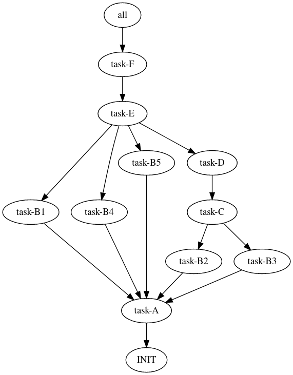

Welcome to **makbet** project!

|

**makbet** stands for **mak**\ (efile) **b**\ (ased) **e**\ (xtraordinary)
**t**\ (ool).

Keep reading && have fun! :)

|

Why?
====

This project has been created for several reasons...

Mainly to help:

- automating various complex scenarios,
- modelling, and prototyping complex real-life processes
  (e.g.: production/delivery chain) consisting of many tasks having many
  dependencies,
- reflecting, simulating and profiling complicated existing flows,
- visualizing dependencies in big projects (can help to find circular
  dependencies, or long execution paths),
- optimizing execution paths in existing systems.

But also to help:

- learning **GNU make** utility,
- learning **DOT** language,
- learning bash scripting.

|

And (the last but not least):

- **FOR FUN! :)**

|

Features
========

**makbet's** key features are:

- based on **GNU make** tool and its features,
- easy extensible,
- contains built-in minimalistic tasks library (set of bash scripts),
- support for parallelism,
- can be easy added/embedded into existing projects as 3rd party SW,
- pure console tool - no GUI required,
- good and fast integration with other console programs,
- unified naming scheme for all makbet's specific environment variables
  (every variable has ``MAKBET_`` prefix),
- unified syntax for all makbet's CLI options (every option has
  ``MAKBET_`` prefix),
- saving tasks' details in **key=value** ``*.cfg`` files for further
  usage (e.g.: by shell scripts),
- saving tasks' details in ``*.csv`` files for futher processing if needed
  (this feature can be enabled by ``MAKBET_CSV=1`` CLI option),
- profiling - measuring tasks duration (this feature can be enabled by
  ``MAKBET_PROFILES=1`` CLI option),
- generating **DOT** output showing relations between tasks (this feature can
  be enabled by ``MAKBET_DOT=1`` CLI option),
- minimal system requirements (see below).

|

System requirements
===================

Well... nothing special here :)

The only system requirements are:

- GNU linux OS
- GNU make tool (version **3.82+**)
- bash tool

All example scenarios have been successfully tested with with **GNU make 4.3**
and **bash 5.0.16**.

|

Installing
==========

Installing **makbet** is quite easy.

- Download or clone the **makbet** project from github.
- Export the ``MAKBET_PATH`` variable pointing to makbet's main directory
  (e.g.: ``export MAKBET_PATH=/tmp/makbet``).

And that's all. You are now ready to write your own scenarios (or play with
built-in `examples <https://github.com/skaluzka/makbet/tree/master/examples>`_).

|

Few words about backward compatibility
======================================

Please be aware that **makbet** is still in heavy development phase (no
major release has been done so far).

There are a couple of quite nice improvements already proposed for **makbet**,
see the details here https://github.com/skaluzka/makbet/issues.  Therefore
there is no guarantee that backward compatibility will be keept (at least until
the first official version will be released).

|

DOT output
==========

For every properly created scenario **makbet** is able to generate output
in **DOT** language (in form of so-called **digraph** - directed
graph - showing the flow direction between all tasks).  Such output can be
easily saved or redirected to file.  This can be achieved by passing
``MAKBET_DOT=1`` option to ``make`` execution command (by deafult
``MAKBET_DOT=0``) as in below example:

::

    [user@localhost dummy]$ make makbet-clean && make all MAKBET_DOT=1

    2020-06-24 17:54:00 [INFO]: Task "INIT" started.
    2020-06-24 17:54:00 [INFO]: Task "INIT" terminated.

    2020-06-24 17:54:00 [INFO]: Task "task-A" started.

    ...

    2020-06-24 17:54:11 [INFO]: Task "all" started.
    2020-06-24 17:54:11 [INFO]: Task "all" terminated.
    [user@localhost dummy]$

Special makbet's target ``.show-summary-dot-file`` will display **DOT**
results which can be used for further processing:

::

    [user@localhost dummy]$ make .show-summary-dot-file

    digraph {

    	"all" -> "task-F";
    	"INIT";
    	"task-A" -> "INIT";
    	"task-B1" -> "task-A";
    	"task-B2" -> "task-A";
    	"task-B3" -> "task-A";
    	"task-B4" -> "task-A";
    	"task-B5" -> "task-A";
    	"task-C" -> "task-B2";
    	"task-C" -> "task-B3";
    	"task-D" -> "task-C";
    	"task-E" -> "task-B1";
    	"task-E" -> "task-B4";
    	"task-E" -> "task-B5";
    	"task-E" -> "task-D";
    	"task-F" -> "task-E";

    }

    [user@localhost dummy]$

The graph presented below is reflecting above **DOT** code generated for
`dummy <https://github.com/skaluzka/makbet/tree/master/examples/dummy>`_ example
(target ``all``).

Results for `test-scenario2 <https://github.com/skaluzka/makbet/tree/master/examples/test-scenario2>`_
example (target ``all``) can be seen
`here <https://github.com/skaluzka/makbet/tree/master/docs/img/test-scenario2>`_.

Two **DOT** online editors have been successfully tested with **makbet**:

- https://edotor.net/ (fully interactive!)
- http://webgraphviz.com/ (very simple, but works! :D)

|

References
==========

Useful **GNU make** links:

- https://www.gnu.org/software/make/manual/
- http://www.conifersystems.com/whitepapers/gnu-make/

Useful **DOT** language links:

- https://graphviz.gitlab.io/documentation/
- https://en.wikipedia.org/wiki/DOT_%28graph_description_language%29

All **bash** scripts have been checked with ``schellcheck`` utility:

- https://www.shellcheck.net/
- https://github.com/koalaman/shellcheck

|

Contributing
============

Pull requests are welcome! :)

For more details about contributing rules please check
`CONTRIBUTING.rst <https://github.com/skaluzka/makbet/blob/master/CONTRIBUTING.rst>`_
file.

|

Mission statement
=================

*"What's done, is done."* - William Shakespeare, **Macbeth**.

.. The end
