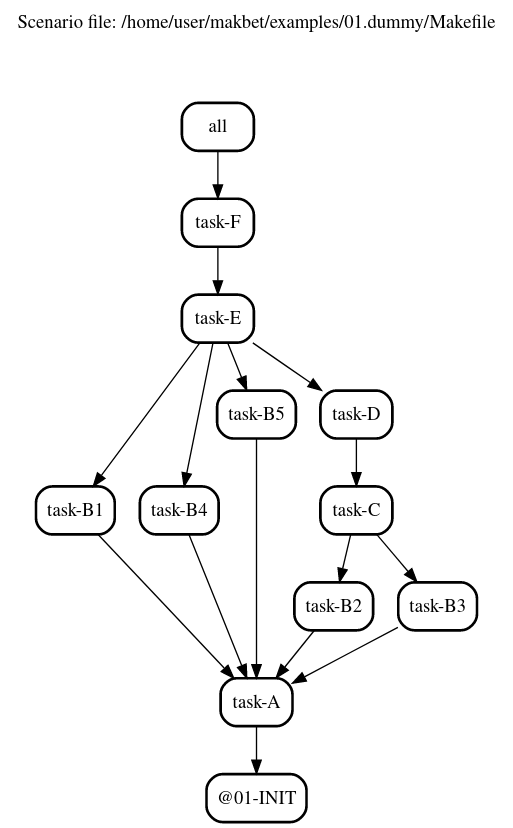

Welcome to **makbet** project!

|

**makbet** stands for **mak**\ (efile) **b**\ (ased) **e**\ (xtraordinary)
**t**\ (ool).

Keep reading && have fun! :)

|

----

**Table of Contents**
---------------------

- | `Why?`_
- | `Features`_
- | `System requirements`_
- | `Installing`_
- | `Few words about backward compatibility`_
- | `DOT output`_
- | `CSV output`_
- | `References`_
- | `Contributing`_
- | `License`_
- | `Mission statement`_

|

Why?
----

This project has been created for several reasons...

Mainly to help:

- automating various complex scenarios,
- modeling, and prototyping complex real-life processes
  (e.g.: production/delivery chain) consisting of many tasks having many
  dependencies,
- reflecting, simulating and profiling complicated existing flows,
- visualizing dependencies in big projects (can help to find circular
  dependencies, or long execution paths),
- optimizing execution paths in existing systems.

But also to help:

- learning **GNU Make** utility,
- learning **DOT** language,
- learning **Bash** scripting.

|

And (the last but not least):

- **FOR FUN! :)**

|

Features
--------

**makbet's** key features are:

- based on **GNU Make** tool and its features,
- easy extensible,
- built-in support for parallelism,
- can be easy added/embedded into existing projects as 3rd party SW,
- pure console tool - no GUI required,
- good and fast integration with other console programs,
- unified naming scheme of all environment variables (every **makbet's**
  environment variable has ``MAKBET_`` prefix),
- unified syntax of all CLI options (every **makbet's** CLI option has
  ``MAKBET_`` prefix),
- saving tasks' details in **key=value** ``*.cfg`` files for further
  usage (e.g.: by shell scripts),
- saving tasks' details in ``*.csv`` files for further processing if needed
  (this feature can be enabled by ``MAKBET_CSV=1`` CLI option),
- profiling - measuring tasks duration (this feature can be enabled by
  ``MAKBET_PROF=1`` CLI option),
- generating **DOT** output showing relations between tasks (this feature can
  be enabled by ``MAKBET_DOT=1`` CLI option),
- it is pretty well documented,
- has a couple of quite nice examples, including small built-in tasks library
  (set of simple **Bash** scripts),
- minimal system requirements (see below).

|

System requirements
-------------------

Well... Nothing special here :)

The only system requirements are:

- GNU Linux OS
- GNU Make tool (version **3.82+**)
- Bash tool

All example scenarios have been successfully tested with **GNU Make 4.3** and
**Bash 5.0.16**.

|

Installing
----------

Installing **makbet** is quite easy.

- Download or clone the **makbet** project from GitHub.
- Export the ``MAKBET_PATH`` variable pointing to **makbet's** main directory
  (e.g.: ``export MAKBET_PATH=/home/user/makbet``).
- Change directory to main **makbet's** directory then run ``make`` command to
  see the help message.

And that's all.  You are now ready to write your own scenarios (or play with
built-in `examples <examples>`_).

|

Few words about backward compatibility
--------------------------------------

Please be aware that **makbet** is still in heavy development phase (no
major release has been published so far).

There are a couple of quite nice improvements already proposed for **makbet**,
see the details `here <https://github.com/skaluzka/makbet/issues>`_.  Therefore
there is no guarantee that backward compatibility will be kept all the time
(at least until the first official version will be released).

|

DOT output
----------

For every properly created scenario **makbet** is able to generate output
in **DOT** language (in form of so-called **digraph** - directed
graph - showing the flow direction between all tasks).  Such output can be
easily saved or redirected to file.  This can be achieved by passing
``MAKBET_DOT=1`` option to ``make`` execution command (by default
``MAKBET_DOT=0``) as in below example:

::

    [user@localhost 01.dummy]$ make makbet-clean && make all MAKBET_DOT=1

    2020-08-10 00:54:58.826 [INFO]: Task "@01-INIT" (TASK_ID: 1) started.

    2020-08-10 00:54:58.844 [INFO]: Task "@01-INIT" (TASK_ID: 1) terminated.

    2020-08-10 00:54:58.918 [INFO]: Task "task-A" (TASK_ID: 2) started.

    ...

    2020-08-10 00:55:09.030 [INFO]: Task "all" (TASK_ID: 13) started.

    2020-08-10 00:55:09.047 [INFO]: Task "all" (TASK_ID: 13) terminated.

    [user@localhost 01.dummy]$

Special **makbet's** target ``.show-summary-dot-file`` will display **DOT**
results which can be used for further processing:

::

    [user@localhost 01.dummy]$ make .show-summary-dot-file

    digraph {

    // This file has been generated by makbet heads/master-0-g88262d1
    // Generation date: Wed 19 Aug 2020 01:21:07 AM CEST
    // Input: /home/user/makbet/examples/01.dummy/Makefile

    // Graph title.
    labelloc="t";
    label="/home/user/makbet/examples/01.dummy/Makefile\n\n"

    // Node options.
    node [shape=box];

    "all" -> "task-F";

    "@01-INIT";

    "task-A" -> "@01-INIT";

    "task-B1" -> "task-A";

    "task-B2" -> "task-A";

    "task-B3" -> "task-A";

    "task-B4" -> "task-A";

    "task-B5" -> "task-A";

    "task-C" -> "task-B2";
    "task-C" -> "task-B3";

    "task-D" -> "task-C";

    "task-E" -> "task-B1";
    "task-E" -> "task-B4";
    "task-E" -> "task-B5";
    "task-E" -> "task-D";

    "task-F" -> "task-E";

    }

    // End of file

    [user@localhost 01.dummy]$

Below graph picture has been rendered, by
`edotor <https://edotor.net/>`_ online **DOT** editor, based on above
``digraph`` code
(`01.dummy <examples/01.dummy/Makefile>`_
example, target ``all``).

| The **DOT** files together with corresponding **png** images, for all
  **makbet's** examples, can be found
  `here <docs/examples/>`__.

|

Two **DOT** online editors have been successfully tested with **makbet**:

- https://edotor.net/ (fully interactive!)
- http://webgraphviz.com/ (very simple, but works! :D)

|

CSV output
----------

For every properly created scenario **makbet** is able to generate valuable
**CSV** output.  Such output (similar as for **DOT** language above) can be
easily saved or redirected to file.  This can be achieved by passing
``MAKBET_CSV=1`` option to ``make`` execution command (by default
``MAKBET_CSV=0``) as in below example:

::

    [user@localhost 01.dummy]$ make makbet-clean && make all MAKBET_CSV=1

    2020-08-10 01:26:10.847 [INFO]: Task "@01-INIT" (TASK_ID: 1) started.

    2020-08-10 01:26:10.865 [INFO]: Task "@01-INIT" (TASK_ID: 1) terminated.

    2020-08-10 01:26:10.943 [INFO]: Task "task-A" (TASK_ID: 2) started.

    ...

    2020-08-10 01:26:21.358 [INFO]: Task "all" (TASK_ID: 13) started.

    2020-08-10 01:26:21.375 [INFO]: Task "all" (TASK_ID: 13) terminated.

    [user@localhost 01.dummy]$

Special **makbet's** target ``.show-summary-events-csv-file`` will display
**CSV** results which can be used for further processing:

::

    [user@localhost 01.dummy]$ echo ; make .show-summary-events-csv-file

    TASK_ID;TASK_NAME;TASK_DEPS;TASK_CMD;TASK_CMD_OPTS;TASK_EVENT_TYPE;TASK_DATE_TIME_[STARTED|TERMINATED];
    "10";"task-E";"task-B1 task-B4 task-B5 task-D";"/home/user/makbet/examples/01.dummy/tasks/generic-task.sh";"1";"2020-08-10 01:12:29.733308483";"STARTED";
    "10";"task-E";"task-B1 task-B4 task-B5 task-D";"/home/user/makbet/examples/01.dummy/tasks/generic-task.sh";"1";"2020-08-10 01:12:30.761029443";"TERMINATED";
    "11";"task-F";"task-E";"";"";"2020-08-10 01:12:30.841904980";"STARTED";
    "11";"task-F";"task-E";"";"";"2020-08-10 01:12:30.859621988";"TERMINATED";
    "13";"all";"task-F";"";"";"2020-08-10 01:12:30.936875884";"STARTED";
    "13";"all";"task-F";"";"";"2020-08-10 01:12:30.954203599";"TERMINATED";
    "1";"@01-INIT";"";"";"";"2020-08-10 01:12:20.677030775";"STARTED";
    "1";"@01-INIT";"";"";"";"2020-08-10 01:12:20.695026472";"TERMINATED";
    "2";"task-A";"@01-INIT";"/home/user/makbet/examples/01.dummy/tasks/generic-task.sh";"1";"2020-08-10 01:12:20.771642001";"STARTED";
    "2";"task-A";"@01-INIT";"/home/user/makbet/examples/01.dummy/tasks/generic-task.sh";"1";"2020-08-10 01:12:21.797396614";"TERMINATED";
    "3";"task-B1";"task-A";"/home/user/makbet/examples/01.dummy/tasks/generic-task.sh";"1";"2020-08-10 01:12:21.904037125";"STARTED";
    "3";"task-B1";"task-A";"/home/user/makbet/examples/01.dummy/tasks/generic-task.sh";"1";"2020-08-10 01:12:22.938594079";"TERMINATED";
    "4";"task-B2";"task-A";"/home/user/makbet/examples/01.dummy/tasks/generic-task.sh";"1";"2020-08-10 01:12:25.253225518";"STARTED";
    "4";"task-B2";"task-A";"/home/user/makbet/examples/01.dummy/tasks/generic-task.sh";"1";"2020-08-10 01:12:26.279625813";"TERMINATED";
    "5";"task-B3";"task-A";"/home/user/makbet/examples/01.dummy/tasks/generic-task.sh";"1";"2020-08-10 01:12:26.356675852";"STARTED";
    "5";"task-B3";"task-A";"/home/user/makbet/examples/01.dummy/tasks/generic-task.sh";"1";"2020-08-10 01:12:27.383623260";"TERMINATED";
    "6";"task-B4";"task-A";"/home/user/makbet/examples/01.dummy/tasks/generic-task.sh";"1";"2020-08-10 01:12:23.034913980";"STARTED";
    "6";"task-B4";"task-A";"/home/user/makbet/examples/01.dummy/tasks/generic-task.sh";"1";"2020-08-10 01:12:24.061618650";"TERMINATED";
    "7";"task-B5";"task-A";"/home/user/makbet/examples/01.dummy/tasks/generic-task.sh";"1";"2020-08-10 01:12:24.149537992";"STARTED";
    "7";"task-B5";"task-A";"/home/user/makbet/examples/01.dummy/tasks/generic-task.sh";"1";"2020-08-10 01:12:25.177132690";"TERMINATED";
    "8";"task-C";"task-B2 task-B3";"/home/user/makbet/examples/01.dummy/tasks/generic-task.sh";"1";"2020-08-10 01:12:27.465630249";"STARTED";
    "8";"task-C";"task-B2 task-B3";"/home/user/makbet/examples/01.dummy/tasks/generic-task.sh";"1";"2020-08-10 01:12:28.493330313";"TERMINATED";
    "9";"task-D";"task-C";"/home/user/makbet/examples/01.dummy/tasks/generic-task.sh";"1";"2020-08-10 01:12:28.613558801";"STARTED";
    "9";"task-D";"task-C";"/home/user/makbet/examples/01.dummy/tasks/generic-task.sh";"1";"2020-08-10 01:12:29.646787712";"TERMINATED";

    [user@localhost 01.dummy]$

| Above results (which are valid for **01.dummy** example) have been saved into
  this
  `results.csv <docs/examples/01.dummy/results.csv>`__ file.
| Results for other **makbet's** examples are available
  `here <docs/examples/>`__.

|

References
----------

Useful **GNU Make** links:

- https://www.gnu.org/software/make/manual/
- http://www.conifersystems.com/whitepapers/gnu-make/

Useful **DOT** language links:

- https://graphviz.gitlab.io/documentation/
- https://en.wikipedia.org/wiki/DOT_%28graph_description_language%29

Useful **CSV** links:

- https://tools.ietf.org/html/rfc4180
- https://en.wikipedia.org/wiki/Comma-separated_values
- https://www.convertcsv.com/csv-viewer-editor.htm

All **Bash** scripts have been checked with ``schellcheck`` utility:

- https://www.shellcheck.net/
- https://github.com/koalaman/shellcheck

|

Contributing
------------

Pull requests are welcome! :)

For more details about contributing rules please check
`CONTRIBUTING.rst <CONTRIBUTING.rst>`_
file.

|

License
-------

**makbet** is licensed under the
`MIT <LICENSE>`_
license.

|

Mission statement
-----------------

*"What's done, is done."* - William Shakespeare, **Macbeth**.

.. End of file
